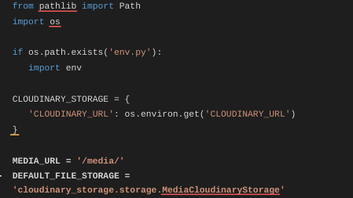
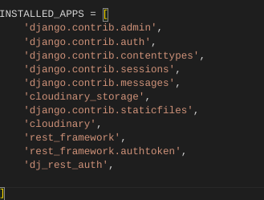
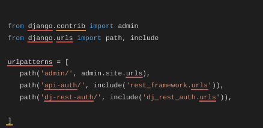
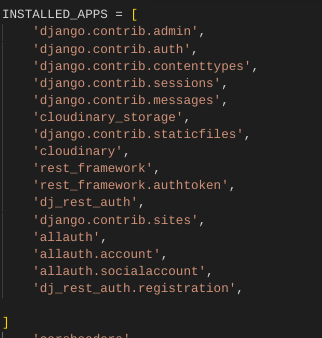
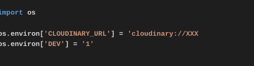
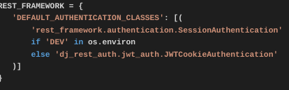
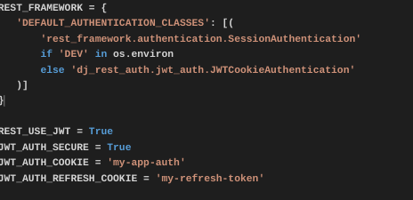
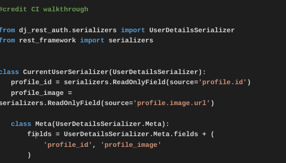

# ReviewMe API

## Introduction

Review Me is a website where users can review any kind of beauty product and share their experience and valuable feedback with the rest of the platform. Users are able to review the product bit describing their opinion, inserting the paid price and the relative picture.

This repository holds Django Rest Framework (DRF) API tp support Reactjs frontend project.

## Live Site

Deployed Backend API link
Deployed Frontend live link

## Github Repository"

Backend Repository
Frontend Repository

## Table Of Contents

- [Introduction](#introduction "Introduction")
  - [Live-site](#live-site "Live Site")
  - [Github-repository](#github-repository "Github Repository")
- [User Stories](#user-stories "User Stories") >LINK TO REACT
- [Wireframes](#wireframes "Wireframes")
    - [Database Schema](#database-schema "Database Schema")

- [Testing](#testing "Testing")
- [Bugs](#bugs "Bugs")
  - [Known Bug-Issues](#known-bug-issues "Known Bug-Issues")
- [Technologies used](#technologies-used "Technologies used")
  - [Main Language Used](#main-language-used "Main Language Used")
  - [Frameworks Libraries Used](#frameworks-libraries-used "Frameworks Libraries Used")
- [Additional Resources](#additional-resources "Additional Resources")

- [Deployment](#deployment "Deployment")
 - - [Project Setup](#project-setup "Project Setup")
- [Final Deployment](#final-deployment "Final Deployment")
- [Credits](#credits "Credits")

## User Stories

User stories for backend can be found in a separate internal [file](static/userstories.md)
A better overview was made by creating Tasks throught Kanban Boiard

## Wireframes

The database models for the project were created based on the following schema:

- 

## Testing

All manual testing can be found [here](static/testing.md)

## Bugs

## Known Bug-Issues

## Technologies used

### Main Language Used:
- Python

### Frameworks Libraries Used
- [Django](https://www.djangoproject.com/)
- [Django REST Framework](https://www.django-rest-framework.org/)

-[Cors Headers](https://www.django-rest-framework.org/topics/ajax-csrf-cors/)
-[Django Rest Auth](https://dj-rest-auth.readthedocs.io/en/latest/installation.html)
-[Cloudinary](https://cloudinary.com/) to host images
-[Heroku](https://www.heroku.com/)
-[Pillow](https://pillow.readthedocs.io/en/stable/) for image processing
-[ElephantSQL](https://www.elephantsql.com/) for database

## Deployment

### Project Setup:
1. The Project is created with Github using [Code Institute template](https://github.com/Code-Institute-Org/gitpod-full-template)

Here are the steps:

- Click on "Use this template"
- Click on "Create a new repository"
- Choose a repository Name: 
- Insert a description (optional)
Click on "Create repository from template"

### Run the workspace:
- Click on ‘Gitpod’

2. Once the workspace is running, install Django with command:
-       pip3 install 'django<4' 

3. Start project with command::
-       django-admin startproject (projectaname) reviewme_api .
 (*space dot at the end to start in in the current directory*)

4. Install Django Cloudinary storage:
-       pip install django-cloudinary-storage

5. Install Pillow:
-       pip install Pillow (*Uppercase P*)

6. Add the newly installed apps 'cloudinary_storage' and 'cloudinary' to INSTALLED_APPS in settings.py as shown below:

- 

7. Setup Environment Variable in top directory:
  - create file env.py
  - import os module
  - import cloudinary environment variable from CLoudinary dashboard as shown below:

import os
os.environ["CLOUDINARY_URL"] = "cloudinary://API KEY HERE"

8.In settings.py load environment variable with cloudinary credentials and store media

- 

### Json Web Token Setup

1. Install JSON Web Token with command:
 -      pip install dj-rest-auth

2. Add dj_rest_auth app to INSTALLED_APPS in your django settings.py:

- 

3. Add the dj-rest-auth urls paths to the main urls.py file as showbelow:

- 

4. Migrate the database with terminal command:
-       python manage.py migrate

5. For users to be able to register, install Django AllAuth with terminal command:
-       pip install 'dj-rest-auth[with_social]'

6. Add it to your settings.py:

- 

7. In settings.py Set SITE_ID to 1:
- SITE_ID = 1

8.In main urls.py add the registration urls below to file:

-     path(
        'dj-rest-auth/registration/', include('dj_rest_auth.registration.urls')
    ),

9. Install JSon Tokens with command:
-      pip install djangoframework-simplejwt

10. In env.py file Set [DEV] to 1:

- 

11. This value can be used to check if project is in development or production. Add the following if/else statement to settings.py:

- 

12. In settings.py to enable token authentication, set REST_USE_JWT to True. To ensure tokens are sent over HTTPS only, set JWT_AUTH_SECURE to True. Cookie names must also be declared. Insert below the aboce code:

- 

13. Create serializers.py file in the drf_api directory, and copy UserDetailsSerializer code from Django documentation as follows:

- 

14. In settings.py overwrite the default user detail serializer with the following code:

- 

15. Migrate the database again with terminal command:
-        python manage.py migrate

16. Update requirements.txt file with new dependencies by running command 
-       pip freeze > requirements.txt

17. Add, commit and push all the changes.

