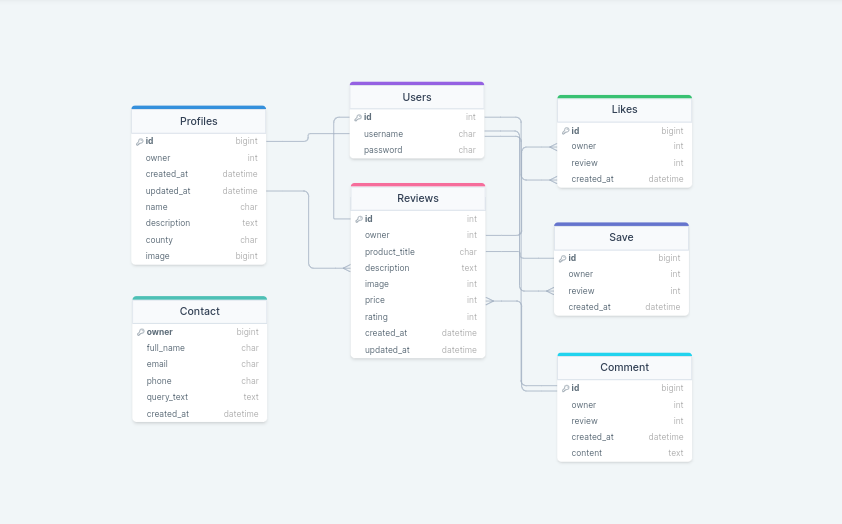
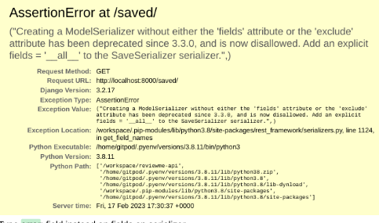
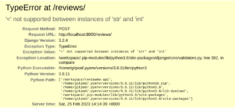
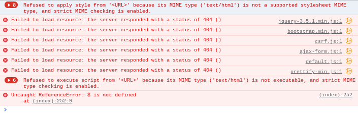

# ReviewMe API

## Introduction

Review Me is a website where users can review any kind of beauty product and share their experience and valuable feedback with the rest of the platform. Users are able to review the product by describing their opinion, inserting the paid price and the relative picture.

This repository holds Django Rest Framework (DRF) API to support Reactjs frontend project.

## Live Site

[Deployed Backend API link](https://drf-reviewme.herokuapp.com/)

[Deployed Frontend live link](https://reviewme.herokuapp.com/) 

## Github Repository

[Backend Repository](https://github.com/aimansae/reviewme-api)

[Frontend Repository](https://github.com/aimansae/reviewme)

## Table Of Contents

- [Introduction](#introduction "Introduction")
  - [Live-site](#live-site "Live Site")
  - [Github Repository](#github-repository "Github Repository")
- [User Stories](#user-stories "User Stories")
- [Database Schema](#database-schema "Database Schema")
- [Testing](#testing "Testing")
- [Validation](#validation "Validation")

- [Bugs](#bugs "Bugs")
  - [Known Bug-Issues](#known-bug-issues "Known Bug-Issues")
- [Technologies used](#technologies-used "Technologies used")
  - [Main Language Used](#main-language-used "Main Language Used")
  - [Frameworks Libraries Used](#frameworks-libraries-used "Frameworks Libraries Used")
- [Additional Resources](#additional-resources "Additional Resources")
- [Deployment](#deployment "Deployment")
  - [Project Setup](#project-setup "Project Setup")
  - [Deploy to Heroku](#deploy-to-heroku "Deploy to Heroku")
    - [Creating the database](#creating-the-database "Creating the database")
    - [Creating Heroku App](#creating-heroku-app "Creating Heroku App")
- [Credits](#credits "Credits")

## User Stories

User stories for backend can be found in a separate internal [file](static/readmeDocs/userstories.md)
A better overview was made by creating Tasks through Github [Issues](https://github.com/aimansae/reviewme/issues) and [Kanban Board](https://github.com/users/aimansae/projects/6) on the frontend side

## Database Schema

The database models for the project were created based on the following schema:

- 

## Testing

All manual testing can be found [here](static/readmeDocs/testing.md)

## Validation

Validation was conducted thorught Code Institute [PEP8](https://pep8ci.herokuapp.com/#) tool, it passed with no errors Settings.py and contact model, present some line too long warnings, ignored momentarily.

## Bugs

1. When deploying the APP to heroku, the build failed with the following error:

```
Node version not specified in package.json
```

- **Fixed** by following [Heroku No Node Version Error](https://help.heroku.com/6235QYN4/why-is-my-node-js-build-failing-because-of-no-matching-node-versions)

Checked node version with command:

- node --version

In Package.json, underneath version add engines, node versions:

```
{
  "name": "myapp",
  "description": "a really cool app",
  "version": "1.0.0",
  ADD HERE
  "engines": {
    "node": "6.11.1"
  }
}

```

Add, commit push and deployed successfully!

2. In Saved/ serializers.py got Error

AssertionError at saved/:



**Fixed** as I had a typo, I inserted field, instead of fields.

3. In comments/ serializers.py, while adding function

```
def get_created_at(self, obj):
return naturaltime(obj.created_at)
```

- Got error : Django AttributeError 'datetime.date' object has no attribute 'utcoffset'

**Fixed** by modifying model:

`updated_at = models.DateField(auto_now=True)`
to
`updated_at = models.DateTimeField(auto_now=True)`

and migrating again

4.Upon running review/ views.py and trying to insert a review got error:

- <' not supported between instances of 'str' and 'int'.
  

**Fixed by** changig choice field firs values form string to number as sown below:

```

RATING_CHOICES = [
       (0, '0'),
       (1, '1'),
       (2, '2'),
       (3, '3'),
       (4, '4'),
       (5, '5'),
]
```

5. local workspace kept throwing MIME and 404() errors as shown below
   

**Fixed** thanks to tutor's help, by adding DEBUG=False to settings.py

## Known Bug-Issues

Adming page not being styled. Tried to remove Collect stativ var from Heroku, as advised by tutor, but that did not resolve the issue.

## Technologies used

### Main Language Used:

- Python

### Frameworks Libraries Used

- [Django](https://docs.djangoproject.com/en/3.2/)
- [Django REST Framework](https://www.django-rest-framework.org/)
- [Cors Headers](https://www.django-rest-framework.org/topics/ajax-csrf-cors/)
- [Django Rest Auth](https://dj-rest-auth.readthedocs.io/en/latest/installation.html)
- [Cloudinary](https://cloudinary.com/) to host images
- [Heroku](https://www.heroku.com/)
- [Pillow](https://pillow.readthedocs.io/en/stable/) for image processing
- [ElephantSQL](https://www.elephantsql.com/) for database

### Additional Resources

- [DrawSQL](https://drawsql.app/) was used to create Database schema

## Deployment

### Project Setup:

1. The Project is created with Github using [Code Institute template](https://github.com/Code-Institute-Org/gitpod-full-template)

Here are the steps:

- Click on "Use this template"
- Click on "Create a new repository"
- Choose a repository Name:
- Insert a description (optional)
  Click on "Create repository from template"

### Run the workspace:

- Click on ‘Gitpod’

2. Once the workspace is running, install Django with command:

-       pip3 install 'django<4'

3. Start project with command::

-       django-admin startproject (projectaname) reviewme_api .
  (_space dot at the end to start in in the current directory_)

4. Install Django Cloudinary storage:

-       pip install django-cloudinary-storage

5. Install Pillow:

-       pip install Pillow (*Uppercase P*)

6. Add the newly installed apps 'cloudinary_storage' and 'cloudinary' to INSTALLED_APPS in settings.py as shown below:

```
INSTALLED_APPS = [
    'django.contrib.admin',
    'django.contrib.auth',
    'django.contrib.contenttypes',
    'django.contrib.sessions',
    'django.contrib.messages',
    'cloudinary_storage',
    'django.contrib.staticfiles',
    'cloudinary',

```

7. Setup Environment Variable in top directory:

- create file env.py
- import os module
- import cloudinary environment variable from CLoudinary dashboard as shown below:

import os
os.environ["CLOUDINARY_URL"] = "cloudinary://API KEY HERE"

8.In settings.py load environment variable with cloudinary credentials and store media

```
import os

if os.path.exists('env.py'):
    import env

CLOUDINARY_STORAGE = {
    'CLOUDINARY_URL': os.environ.get('CLOUDINARY_URL')
}
MEDIA_URL = '/media/'
DEFAULT_FILE_STORAGE = 'cloudinary_storage.storage.MediaCloudinaryStorage'

```

### Json Web Token Setup

1. Install JSON Web Token with command:

-      pip install dj-rest-auth

2. Add dj_rest_auth app to INSTALLED_APPS in your django settings.py:

```
INSTALLED_APPS = [
    'django.contrib.admin',
    'django.contrib.auth',
    'django.contrib.contenttypes',
    'django.contrib.sessions',
    'django.contrib.messages',
    'cloudinary_storage',
    'django.contrib.staticfiles',
    'cloudinary',
    'location_field.apps.DefaultConfig',
    'rest_framework',
    'django_filters',
    'rest_framework.authtoken',
    'dj_rest_auth',
```

3. Add the dj-rest-auth urls paths to the main urls.py file as showbelow:

```urlpatterns = [
    path('', root_route),
    path('admin/', admin.site.urls),
    path('api-auth/', include('rest_framework.urls')),
    path('dj-rest-auth/', include('dj_rest_auth.urls')),
```

4. Migrate the database with terminal command:

-       python manage.py migrate

5. For users to be able to register, install Django AllAuth with terminal command:

-       pip install 'dj-rest-auth[with_social]'

6. Add it to your settings.py:

```
    'django.contrib.sites',
    'allauth',
    'allauth.account',
    'allauth.socialaccount',
    'dj_rest_auth.registration',
```

7. In settings.py Set SITE_ID to 1:

```
SITE_ID = 1
```

8. In main urls.py add the registration urls below to file:

```
    path(
        'dj-rest-auth/registration/', include('dj_rest_auth.registration.urls')
    ),
```

9. Install JSon Tokens with command:

-      pip install djangoframework-simplejwt

10. In env.py file Set [DEV] to 1:

```
os.environ['DEV'] = '1'
```

11. This value can be used to check if project is in development or production. Add the following if/else statement to settings.py:

```
REST_FRAMEWORK = {
    'DEFAULT_AUTHENTICATION_CLASSES': [(
        'rest_framework.authentication.SessionAuthentication'
        if 'DEV' in os.environ
        else 'dj_rest_auth.jwt_auth.JWTCookieAuthentication'
    )],
```

12. In settings.py to use token authentication, set REST_USE_JWT to True. To ensure tokens are sent over HTTPS only, set JWT_AUTH_SECURE to True. Cookie names must also be declared. Insert below the aboce code:

```
REST_USE_JWT = True
JWT_AUTH_SECURE = True
JWT_AUTH_COOKIE = 'my-app-auth'
JWT_AUTH_REFRESH_COOKIE = 'my-refresh-token'
```

13. Create serializers.py file in the drf_api directory, and copy UserDetailsSerializer code from Django documentation as follows:

```
from dj_rest_auth.serializers import UserDetailsSerializer
from rest_framework import serializers


class CurrentUserSerializer(UserDetailsSerializer):

    """Serializer for Current User"""
    profile_id = serializers.ReadOnlyField(source='profile.id')
    profile_image = serializers.ReadOnlyField(source='profile.image.url')

    class Meta(UserDetailsSerializer.Meta):
        """Meta class to to specify fields"""
        fields = UserDetailsSerializer.Meta.fields + (
            'profile_id', 'profile_image'
        )
```

14. In settings.py overwrite the default user detail serializer with the following code:

```
REST_AUTH_SERIALIZERS = {
    'USER_DETAILS_SERIALIZER': 'drf_api.serializers.CurrentUserSerializer'
}

```

15. Migrate the database again with terminal command:

-        python manage.py migrate

16. Update requirements.txt file with new dependencies by running command

-       pip freeze > requirements.txt

17. Add, commit and push all the changes.

18. Add a custom message in the root_route.

- create views.py in main root and add the following:

```
from rest_framework.decorators import api_view
from rest_framework.response import Response

@api_view()
def root_route(request):
    return Response({
        "message": "Welcome to The Winding Path drf API!"
    })
```

19. Import to the main urls.py file, and add to the top of the urlpatterns:

```
from .views import root_route

urlpatterns = [
   path('', root_route),

```

20. In settings.py(inside REST_FRAMEWORK) set up page pagination, adding:

```
REST_FRAMEWORK = {
    'DEFAULT_AUTHENTICATION_CLASSES': [(
        'rest_framework.authentication.SessionAuthentication'
        if 'DEV' in os.environ
        else 'dj_rest_auth.jwt_auth.JWTCookieAuthentication'
    )],
    'DEFAULT_PAGINATION_CLASS':
    'rest_framework.pagination.PageNumberPagination',
    'PAGE_SIZE': 10,
}
```

21. In settings.py sey default JSON renderer

```
if 'DEV' not in os.environ:
    REST_FRAMEWORK['DEFAULT_RENDERER_CLASSES'] = [
        'rest_framework.renderers.JSONRenderer',
    ]
```

22. In settings.py (under DEFAULT_PAGINATION) set DATETIME_FORMAT with :

```
'DATETIME_FORMAT': '%d %b %y',
```

22. in comments/serializers.py to add how long ago a comment was posted, add:

```
from django.contrib.humanize.templatetags.humanize import naturaltime

created_on = serializers.SerializerMethodField()
updated_on = serializers.SerializerMethodField()

    def get_created_on(self, obj):
        """Method to display when comment was posted"""
        return naturaltime(obj.created_on)

    def get_updated_on(self, obj):
        """Method to display when comment was updated"""
        return naturaltime(obj.updated_on)

```

## Deploy to Heroku

[Code Institute Guide](https://code-institute-students.github.io/deployment-docs/41-pp5-adv-fe/pp5-adv-fe-drf-01-create-a-database)

23. Log in to [ElephantSQL.com] (https://www.elephantsql.com/) to access your dashboard

- Click “Create New Instance”
- Set up your plan:
- Give your plan a Name (_this is commonly the name of the project_)

- Select the Tiny Turtle (Free) plan
- You can leave the Tags field blank
- Select “Select Region”
- Click “Review”
- Check your details are correct and then click “Create instance”
- Return to the ElephantSQL dashboard and click on the database instance name for this project
- In the URL section, click the copy icon to copy the database URL

### Creating Heroku App

24. Log into [Heroku](https://www.heroku.com/) and go to the "Dashboard"

- Click “Create new app”
- Give your app a name and select the region closest to you. When you’re done, click “Create app” to confirm.(_drf-reviewme in my case_)
- Open the Settings tab, click " Reveal Convfig Vars"
- Add a Config Var DATABASE*URL, and for the value, paste your database URL from ElephantSQL (\_do not add quotation marks*)

25. In **Gitpod workspace**, to connect your external databas type command:

- pip3 install dj_database_url==0.5.0 psycopg2

26. In settings.py underneath the import for os import dj_database:

- ```
   import dj_database_url
  ```

27. In settings.py update the detabase like so:

```

DATABASES = {
'default': ({
'ENGINE': 'django.db.backends.sqlite3',
'NAME': BASE_DIR / 'db.sqlite3',
} if 'DEV' in os.environ else dj_database_url.parse(
os.environ.get('DATABASE_URL')
))
}

```

28. In env.py file, add a new environment variable to Gitpod with the key set to DATABASE_URL, and the value to your ElephantSQL database URL

```

import os

os.environ['CLOUDINARY_URL'] = 'cloudinary://YOURLINK

# os.environ['DEV'] = '1'

os.environ['DATABASE_URL'] = 'postgres://YOURLINK

```

29. In the terminal make migrations:

-     python3 manage.py makemigrations --dry-run
      python3 manage.py migrate

- Create a superuser for your new database
-     python3 manage.py createsuperuser

Follow the steps to create your superuser username and password

30. To confirm that Database is connceted, on the ElephantSQL page on the left s select “BROWSER”

- Click the Table queries button, select auth_user
- Click “Execute”, you should see the superuser details. This confirms the tables have been created and you can add data to your database

31. In Gitpod teminal install gunicorn library:

- pip3 install gunicorn django-cors-headers

32. Update requirements.txt bit running command:

- pip freeze --local > requirements.txt

33. Add a Procfile to the top level of the directory and add the following code:

```
release: python manage.py makemigrations && python manage.py migrate
web: gunicorn drf_api.wsgi
```

34. In settings.py update the value of the ALLOWED_HOSTS variable to include your Heroku app’s URL

```

   ALLOWED_HOSTS = ['localhost', 'drf-reviewme.herokuapp.com']

```

35. In settings.py inside INSTALLED_APPS add corsheaders:

```'dj_rest_auth.registration',
    'corsheaders',
```

36. In settings.py at the top of MIDDLEWARE add corsheaders middleware

```
MIDDLEWARE = [
    'corsheaders.middleware.CorsMiddleware',
    'django.middleware.security.SecurityMiddleware',
    'django.contrib.sessions.middleware.SessionMiddleware',
    'django.middleware.common.CommonMiddleware',
    'django.middleware.csrf.CsrfViewMiddleware',
    'django.contrib.auth.middleware.AuthenticationMiddleware',
    'django.contrib.messages.middleware.MessageMiddleware',
    'django.middleware.clickjacking.XFrameOptionsMiddleware',
]
```

37. Under the MIDDLEWARE list, set the ALLOWED_ORIGINS for the network requests made to the server with the following code:

38. In settings.py set allowed origins for network requests and enable cookies

```
if 'CLIENT_ORIGIN' in os.environ:
   CORS_ALLOWED_ORIGINS = [
       os.environ.get('CLIENT_ORIGIN')
   ]
else:
   CORS_ALLOWED_ORIGIN_REGEXES = [
       r"^https://.*\.gitpod\.io$",
   ]

CORS_ALLOW_CREDENTIALS = True
```

39.In settings.py et the JWT_AUTH_SAMESITE to 'None'. Without this the cookies would be blocked:

```
REST_USE_JWT = True
JWT_AUTH_SECURE = True
JWT_AUTH_COOKIE = 'my-app-auth'
JWT_AUTH_REFRESH_COOKIE = 'my-refresh-token'
JWT_AUTH_SAMESITE = 'None'
```

39. In env.py, set SECRET_KEY value to a random value:

```
os.environ['SECRET_KEY'] = 'random value here'
```

40. In settings.py, replace the default SECRET_KEY variable as follows:

```
SECRET_KEY = os.environ.get('SECRET_KEY')
```

41. In settings.py, set DEBUG as follows:

```
DEBUG = 'DEV' in os.environ
```

42. In Heroku settings, config vars, copy the CLOUDINARY_URL and SECRET_KEY values from env.py and paste them

43. Add a config var COLLECT_STATIC and set to 1.

44. In teminal update requirements.txt file with command

-     pip freeze > requirements.txt

45. Add, commit and push changes.

46. In Heroku and click on 'Deploy' Tab. Go to 'Deployment Method' and click on GitHub.

47. Select and conect to the API repository.

48. In 'Manual Deploy' select Main branch and click 'Deploy Branch'.

49. Click on 'Open app' to access deployed app.

## dj-rest-auth bug fix Credit C.I Wlakthrough

dj-test-auth currently has a bug that does not allow users to log out. To fix this, follow these steps:

51. In the drf_api views.py file, imort JWT_AUTH settings from settings.py:

```
from .settings import (
    JWT_AUTH_COOKIE, JWT_AUTH_REFRESH_COOKIE, JWT_AUTH_SAMESITE,
    JWT_AUTH_SECURE,
)
```

then add logout code:

```
@api_view(['POST'])
def logout_route(request):
    """dj-rest-auth-logout-view-fix"""
    response = Response()
    response.set_cookie(
        key=JWT_AUTH_COOKIE,
        value='',
        httponly=True,
        expires='Thu, 01 Jan 1970 00:00:00 GMT',
        max_age=0,
        samesite=JWT_AUTH_SAMESITE,
        secure=JWT_AUTH_SECURE,
    )
    response.set_cookie(
        key=JWT_AUTH_REFRESH_COOKIE,
        value='',
        httponly=True,
        expires='Thu, 01 Jan 1970 00:00:00 GMT',
        max_age=0,
        samesite=JWT_AUTH_SAMESITE,
        secure=JWT_AUTH_SECURE,
    )
    return response

```

52. In main urls.py file, import the logout_route:

```
from .views import root_route, logout_route
```

then, add to the urlpatterns list. The logout_route must be placed above the dafault dj-rest-urls, as below:

```
    path('dj-rest-auth/logout/', logout_route),
    path('dj-rest-auth/', include('dj_rest_auth.urls')),
```

53. Add, commit and push changes.

54. Go back to Heroku and manually deploy again.

## Adding extra required environment variables - for frontend

55. In settings.py, add heroku app url to ALLOWED_HOSTS:

```
ALLOWED_HOSTS = [
    '....herokuapp.com'
    'localhost',
]
```

56.In Heroku 'Settings' tab click 'Reveal config vars'.

57. Add the new ALLOWED_HOST key with the value of your deployed URL (as added to ALLOWED_HOSTS).

58. In settings.py replace the url string with the ALLOWED_HOST environment variable"

```
ALLOWED_HOSTS = [
    os.environ.get('ALLOWED_HOST'),
    'localhost',
]
```

59.In setting.py import the regular expression module at the top of the file

```
import re
```

60. Replace the if/else statement for CLIENT_ORIGIN with the following:

```
if 'CLIENT_ORIGIN_DEV' in os.environ:
    extracted_url = re.match(r'^.+-', os.environ.get('CLIENT_ORIGIN_DEV', ''), re.IGNORECASE).group(0)
    CORS_ALLOWED_ORIGIN_REGEXES = [
        rf"{extracted_url}(eu|us)\d+\w\.gitpod\.io$",
    ]
```

61. Add, commit and push changes.

62. Return to Heroku and manually deploy branch again.

## Credits:

- A huge credit goes to Code Institute's Django DRF walkthrough project, that was used as a main guide to build ReviewMe project.

- Code Institute tutors were consulted during project set up (version) issues and a huge thanks to all of them for the explainations and suggestion to solve the issues I faced.

- Documentation provided by Code institute was highly consulted, such as Django Rest documentation and Django functionality links

- Mentor Martina provided a huge support and guidance for setup and project delivery
